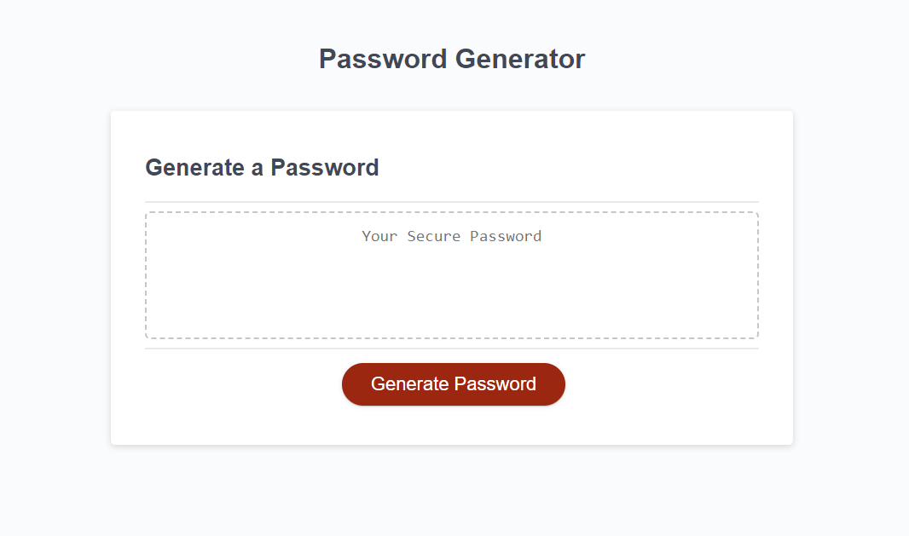
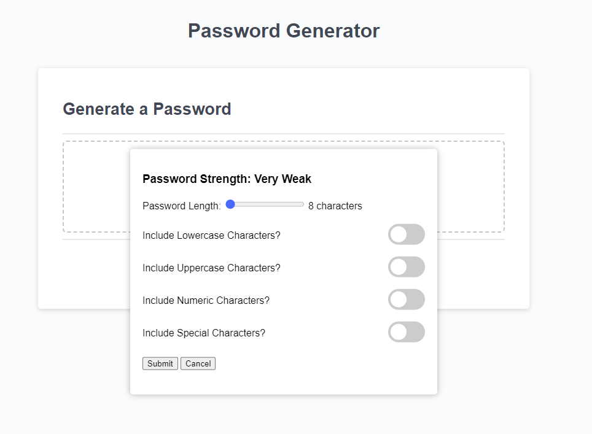
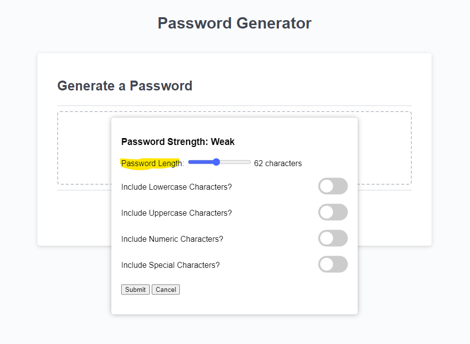
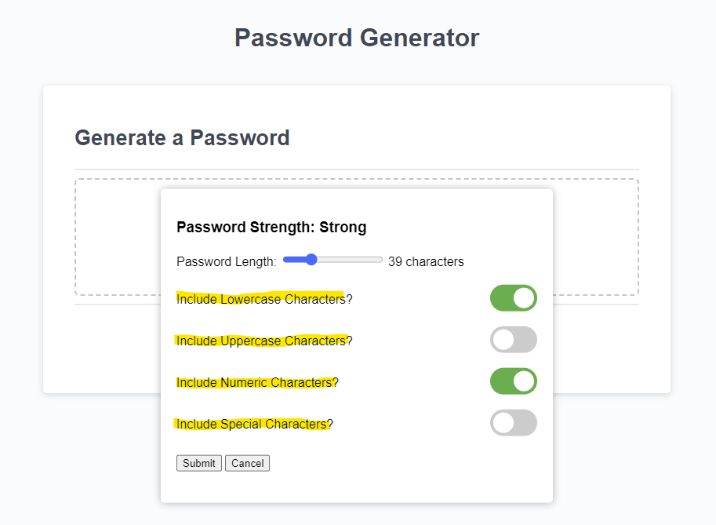
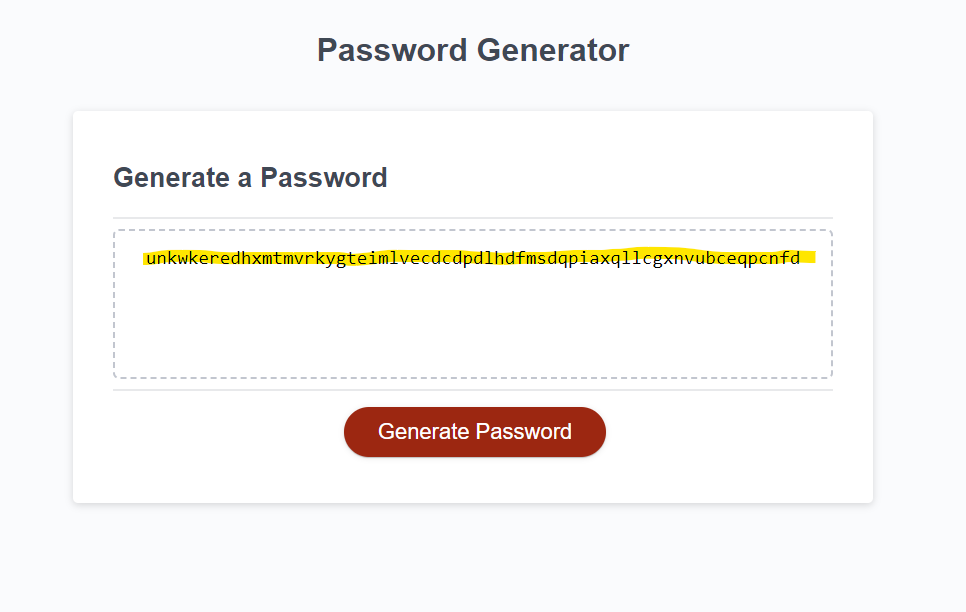
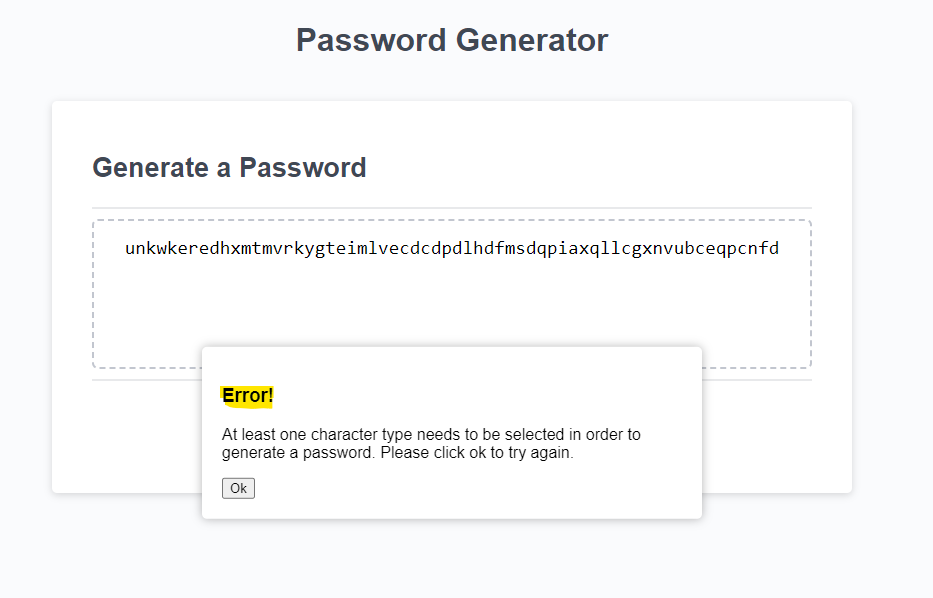

# Password Generator Website

Welcome to the Password Generator website! This site provides an intuitive way to generate random, strong, and secure passwords according to your specified criteria.

## Table of Contents
- [Features](#features)
- [Usage Guide](#usage-guide)
- [Technologies Used](#technologies-used)
- [Feedback and Contribution](#feedback-and-contribution)
- [License](#license)

## Features

1. **Customizable Password Length**: Adjust the length of the generated password.
2. **Character Type Selection**: Choose between lowercase, uppercase, numeric, and special characters to include in the password.
3. **Live Password Strength Indicator**: As you customize your password criteria, a live strength indicator provides feedback on the potential security level of your password.
4. **Easy-to-use Interface**: A clean and responsive design ensures a seamless experience across all devices.

## Usage Guide

1. **Launch the Website**: Start by opening the website in your preferred browser.
2. **Open Password Generator Dialog**:
    - Click on the "Generate Password" button.
    - This will bring up a dialog with various options.

    

3. **Set Password Length**:
    - Use the slider to adjust the desired length of your password.
    - The chosen length will be displayed for your reference.
    - The password strength indicator will update as you change your preferred length.

    

4. **Choose Character Types**:
    - Toggle between lowercase, uppercase, numeric, and special characters using the provided switches.
    - Please note that you MUST choose at least one in order to generate a password.
    - The password strength indicator will update as you choose your character sets.

    

5. **Generate Password**:
    - Once you've set your desired criteria, click the "Submit" button.
    - If no character type is selected, an error dialog will appear. You'll need to select at least one type before proceeding.
    - Your generated password will then be displayed in the main view.

    

6. **Error Handling**:
    - If an error occurs (e.g., no character types are selected), an error dialog will pop up. Simply acknowledge the error and adjust your criteria.

    

## Technologies Used

- HTML5
- CSS3
- JavaScript

## Feedback and Contribution

We welcome feedback and contributions from the community. Please submit any issues or pull requests to our GitHub repository.

## License

This project is licensed under the MIT License. For more details, see the [LICENSE](./LICENSE) file.
